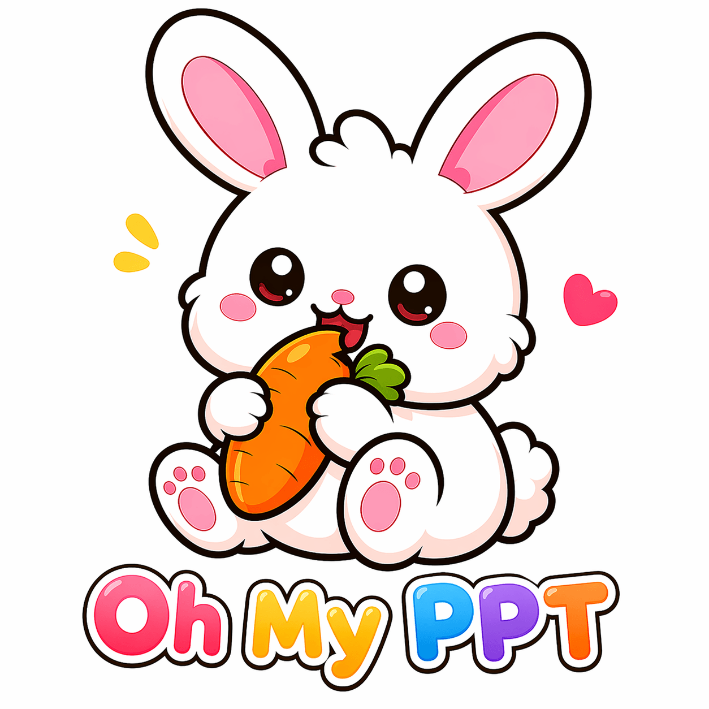
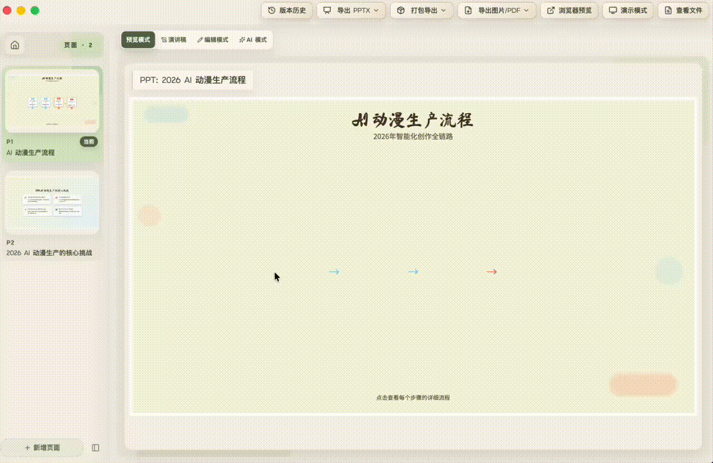
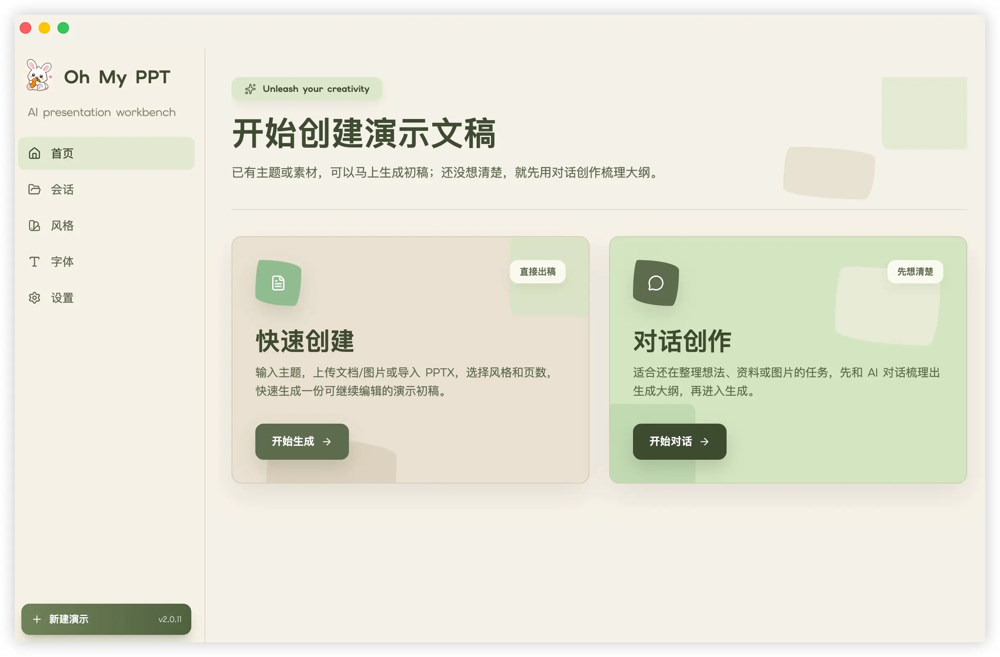
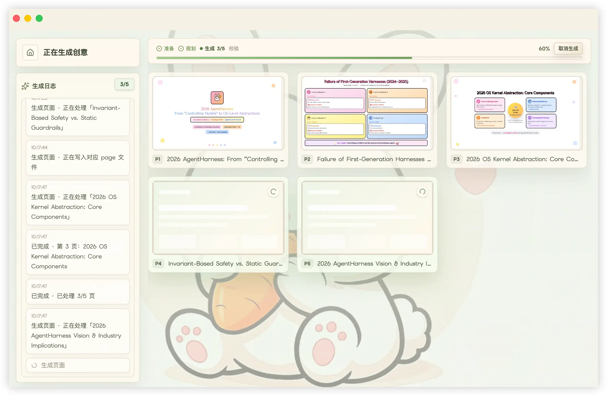
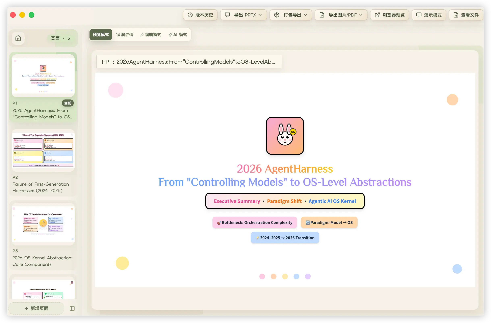
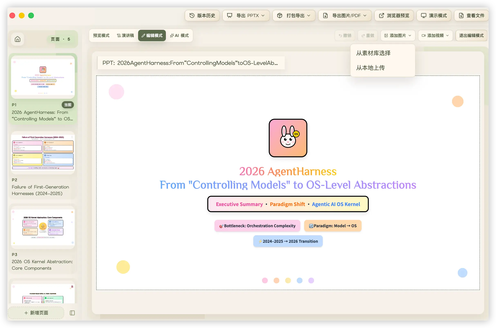
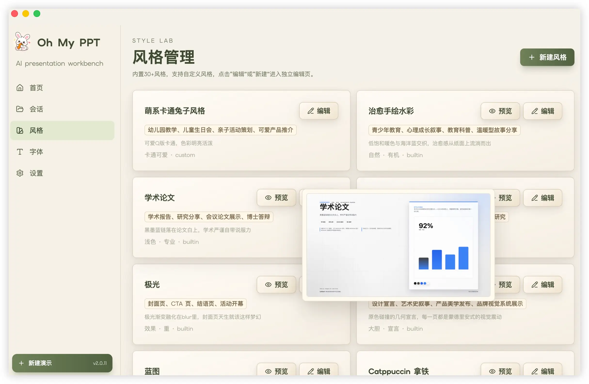
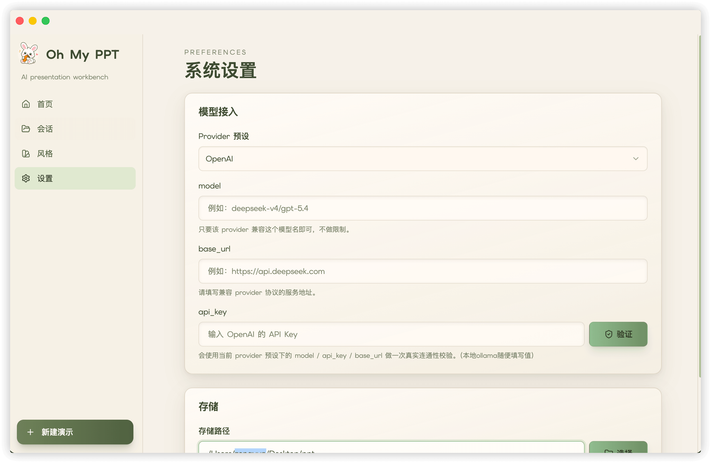
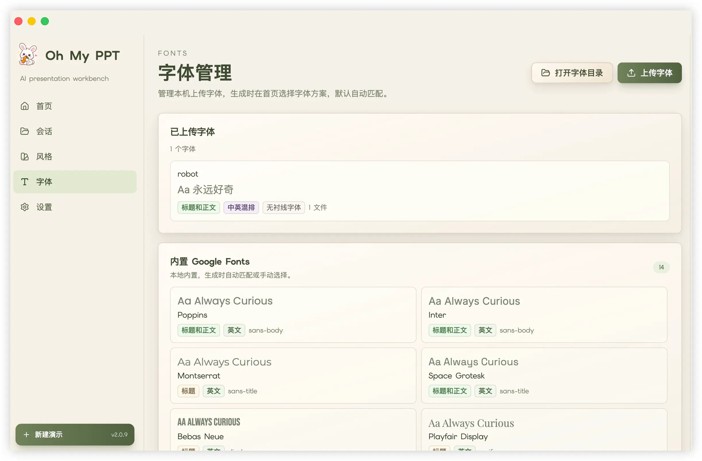

<div align="center">
  
  <br/>
  <br/>


**Oh My PPT — Local-first AI Slide Deck, Image Generation & Editing Workbench**

[繁體中文](./README.md) | [Fork Details](./FORK.md) | [Why Oh My PPT](#why) • [Core Features](#features) • [Workflow](#workflow) • [Changelog](./CHANGELOG.md) • [Usage Notes](#usage-notes)

  <p>
    AI-powered editable HTML, reinventing how next-generation presentations are made.<br/>
    Describe what you want to say and let AI shape the outline, slides, and visuals.<br/>
    Create, edit, present, and export in one local-first workflow.<br/>
    Local-first · Your models, your workflow.
  </p>

> [!NOTE]
> This repository is a Windows-first maintenance fork of [`arcsin1/oh-my-ppt`](https://github.com/arcsin1/oh-my-ppt), licensed under **Apache License 2.0**.
> See [`FORK.md`](FORK.md) and [`NOTICE.md`](NOTICE.md) for maintenance differences and governance boundaries.

  

</div>

---

## Table of Contents

- [Why Oh My PPT](#why)
- [Core Features](#features)
- [Fork-Exclusive Features](#fork-features)
- [Workflow](#workflow)
- [Import Legacy PPTX Templates for Editing](#pptx-import)
- [Export Editable PPTX & Multiple Formats](#export)
- [90+ Built-in Style Skills](#style-skills)
- [AI Image Generation & Smart Visuals](#image-generation)
- [Local Ollama Integration](#ollama)
- [Font Management & Animation Support](#fonts-animations)
- [Windows 11 Native Development](#development)
- [Usage Notes & FAQ](#usage-notes)
- [License & Notice](#license)
- [References](#references)

---

<a id="why"></a>
## Why Oh My PPT

Traditional presentation design often gets bogged down in tedious manual layout tweaks and element alignment. Existing cloud AI presentation tools are mostly closed ecosystems with fixed templates, offering little layout flexibility while posing potential data leakage risks for proprietary business content.

Oh My PPT provides a fresh approach:
- **Editable Web Architecture**: Built on standard HTML/CSS/Tailwind; every slide element, style, hierarchy, and layout can be modified freely after generation.
- **Local-first Architecture**: All data, sessions, documents, and assets remain on your local machine, safeguarding privacy and commercial secrets.
- **Model Flexibility**: Seamlessly connect local Ollama models (e.g. Qwen2.5-Coder, DeepSeek) or cloud APIs (OpenAI, Claude, Gemini) without vendor lock-in.
- **Windows 11 Native Desktop Application**: Built specifically for native Windows 11 with Electron + React + TypeScript; macOS and Linux are not maintained.

---

<a id="features"></a>
## Core Features

- 📥 **Import Legacy PPTX Templates with High Fidelity** — Bring existing PPTX templates and historical files into the desktop app as draggable, editable pages with AI modification and version history; parsing and structured conversion are completely in-house.
- 📤 **Export Editable PPTX with High Fidelity** — Export newly created or edited decks as true PPTX files editable in PowerPoint / Keynote; export engine is fully developed in-house, with complex objects continuously improved.
- 💬 **Topic-based Creation** — Enter topic, detailed brief, and slide requirements; AI plans the outline, palette, and layout to produce a complete deck.
- 🔀 **Multi-task Parallel Generation** — Submit multiple deck creation tasks simultaneously without waiting for one to finish, with automatic desktop notifications upon completion.
- 📐 **Multi-size & Multi-format Canvases** — Supports widescreen, 4:3 projection, vertical 9:16, square 1:1, and social card layouts, preserving real aspect ratios across preview, editing, and export.
- 📄 **Document-based Creation** — Upload txt, md, csv, or docx files; automatically structures the topic, page count, and brief while continuously referencing source materials during generation.
- 🧱 **Template Library & Creation** — Save generated or edited decks as templates, import PPTX files as templates, and reuse them across new sessions.
- 🖼️ **Image-based Style & Outline Recognition** — Upload screenshots or mockups; automatically extracts visual characteristics and generates a tailored style and outline.
- 🖼️ **AI Image Generation & Smart Visuals** — Enable automatic visuals during creation; AI generates illustrations, backgrounds, and assets only where content, layout, and style call for them.
- ✨ **In-editor Image Studio** — Generates prompts from slide titles and outlines, applies custom descriptions and aspect ratios, and inserts results onto the canvas or as backgrounds.
- 🏷️ **Style Filtering for Visuals** — Filter styles in the library that support image generation to keep visual elements consistent with deck aesthetics.
- 🔒 **Local-first Security** — Sessions, source files, assets, and results are kept on your computer without requiring accounts or cloud subscriptions.
- 🔤 **Font Management** — 14 curated Google Fonts built-in (including CJK), supports uploading local fonts, and allows manual or AI-driven pairing of title and body fonts.
- 🎨 **90+ Built-in Style Skills** — Minimal White, Cyber Neon, Bauhaus, Japanese Minimal, and more, plus custom styles.
- ✏️ **Chat-based Editing** — Ask AI to change title colors or add data charts on specific pages without regenerating the entire deck.
- 🖱️ **Visual Canvas Editing** — Every visible element can be dragged, resized, inspected, and refined by AI.
- 📸 **Media Insertion** — Upload images and videos directly from local files or asset libraries alongside AI-generated visuals.
- 📋 **Element Duplication** — One-click duplication of elements with automatic offsets and independent editing.
- ↩️ **Undo & Redo** — Freely undo and redo operations during editing before committing to version history.
- 🖥️ **Presentation Mode** — One-click fullscreen presentation mode with keyboard arrow keys or click navigation.
- 📝 **Speaker Script Generation** — Generates scripts for full decks or individual slides with formal, conversational, storytelling, and custom tones.
- 🎬 **Animation Support** — 16+ slide transition effects plus Anime.js v4-powered element animations.
- 🎞️ **Per-element Animation Controls** — Select individual text, image, or chart elements to configure entrance, emphasis, or exit effects.
- 🧮 **Math Formula Rendering** — Native rendering for common LaTeX formulas.
- 📄 **Multiple Export Formats** — PDF, batch PNG, vertical long PNG, and MP4 video.
- 🏷️ **Session Management** — Differentiates AI-created sessions from imported PPTX files with renaming support.
- 🔄 **Version History Rollback** — Automatic saves on every change with one-click rollback to any prior state.
- 📦 **One-click Standalone Package** — Bundles the HTML deck into a standalone file runnable in any browser without extra software.
- 💾 **Creative Deck Import & Export** — Export AI-generated creative decks from the editor and import them on another machine for seamless collaboration.

<p>



</p>



> Note: The screenshots above are sourced from the upstream project for reference; they will be updated with new captures later.

---

<a id="fork-features"></a>
## 🌟 Fork-Exclusive Features & What's New in v2.5.3

In addition to the core capabilities of Oh My PPT, this maintenance fork introduces several exclusive enhancements:

1. 🌙 **Exclusive "Midnight Forest" Dark Mode Theme**:
   - An ergonomic, high-contrast dark theme designed for extended presentation authoring, adhering to WCAG AAA contrast standards.
   - Structured across a 5-tier elevation hierarchy (Canvas `#111411` → Nav `#151a14` → Cards `#191f18` → Inputs `#20291f` → Popovers `#222c21`), eliminating surface inversion contrast issues.
   - Instant toggle buttons located directly on both the window titlebar and sidebar header, supporting Light, Dark, and System modes with automatic OS appearance synchronization. See [`docs/THEME_MIDNIGHT_FOREST.md`](docs/THEME_MIDNIGHT_FOREST.md) for full design system specifications.

2. 📖 **Built-in Offline Help Center (`/help`)**:
   - Comprehensive offline guides covering FAQs, AI model setup (OpenAI, Claude, Gemini, DeepSeek, Ollama, Qwen), and Thinking/Reasoning JSON parameter references.
   - Direct in-app navigation from the sidebar and settings, completely eliminating external links to the upstream website.
   - Version update checks redirected to this repository's GitHub Releases API, blocking all upstream telemetry.

3. 🪟 **Windows 11 Native-Only Architecture**:
   - Completely pruned non-Windows binaries and cross-platform branches for an optimized, lightweight Windows 11 desktop experience.

4. 🇹🇼 **Full Traditional Chinese Localization & Ad Removal**:
   - Removed simplified Chinese README, aligned bilingual documentation, and purged all upstream advertisements and sponsor links.

---

<a id="workflow"></a>
## Workflow

> 💡 Import a legacy PPTX template to keep editing, or choose a creation mode → confirm topic / materials / page count / canvas format / style / fonts / visuals → AI generates the HTML deck → preview, present, and edit → export an editable PPTX, PDF / PNG / PNG long image / MP4 / packaged HTML

The home page provides several common entry points:

- **Topic-based creation**: Specify topic, canvas format, and detailed brief to create full decks, vertical slides, square cards, or social media formats.
- **Chat to Create**: Clarify topic, materials, audience, structure, and slide key points through multi-turn dialogue when initial requirements need refinement.
- **Document upload parsing**: Upload txt, md, csv, or docx files; the app prepares topic, page count, and descriptions while keeping the original file as reference during generation.
- **Create from template**: Select a saved template from the library to duplicate into an editable PPT session, or supply a new topic while preserving layout, palette, and visual rhythm.

---

<a id="pptx-import"></a>
## Import Legacy PPTX Templates for Editing

Supports parsing existing `.pptx` slides into structured, editable data while preserving layout, color schemes, and structure for AI-assisted continuation.

PPTX parsing and structured conversion are fully developed in-house by Oh My PPT. Complex shapes, charts, tables, animations, mixed text, and extreme layouts continue to improve; actual fidelity varies with source file complexity and font availability.

---

<a id="export"></a>
## Export Editable PPTX & Multiple Formats

Supports six export and sharing pathways:
- **Editable PPTX**: In-house export engine outputs genuine vector files editable in PowerPoint / Keynote.
- **PDF**: Ideal for direct distribution, archiving, and printing.
- **Batch PNG Package**: One-click batch export of all slide pages as images.
- **Long PNG**: Vertically stitches the entire deck into a high-resolution long image for social feeds and mobile reading.
- **MP4 Video**: Exports animated presentation videos for video platforms and marketing demonstrations.
- **Standalone HTML Package**: Packages slides and runtime assets into a single file for offline presentation in any browser.

---

<a id="style-skills"></a>
## 90+ Built-in Style Skills

Integrates a rich library of design styles (business, academic, keynote, minimal, watercolor, etc.) to switch palettes, typography, and decorative elements in one click.

To create custom style skills, use the official generator package: [arcsin1/style-generate-skill](https://github.com/arcsin1/style-generate-skill).



> Note: The screenshots above are sourced from the upstream project for reference; they will be updated with new captures later.

---

<a id="image-generation"></a>
## AI Image Generation & Smart Visuals

Visual generation is accessible through two entry points:

| Scenario | How to Use | Outcome |
| --- | --- | --- |
| Creating a full deck | Add and **verify** a model in "Settings → Image Models"; check "Enable Image Generation" on creation and pick a style tagged with image generation support | AI automatically generates illustrations, backgrounds, or assets only where visual layout calls for them |
| Editing an existing slide | Open the image studio panel in the editor, generate a prompt from slide content or enter your own, and generate with chosen aspect ratios | Preview results, insert onto the canvas, or set directly as slide background |

Supports configuring multiple image generation providers.



> Note: The screenshots above are sourced from the upstream project for reference; they will be updated with new captures later.

---

<a id="ollama"></a>
## Local Ollama Integration (OpenAI-Compatible)

Connect local Ollama completely offline via **OpenAI-compatible protocols**:

In "Settings → Text Models", configure:
- `provider`: `openai`
- `base_url`: `http://127.0.0.1:11434/v1`
- `model`: Pulled local model name (e.g. `qwen2.5-coder:14b` or higher)
- `api_key`: Any non-empty string (e.g. `ollama`)

Note: Local Ollama configurations handle text outline generation, deck drafting, and chat edits; image generation requires configuring an image model separately.

---

<a id="fonts-animations"></a>
## Font Management & Animation Support

- **Font Management**: Supports system fonts, WebFonts, and local font uploads with optimization via `woff2-encoder` and `fonteditor-core`.
- **Page Transitions & Animations**: Built-in minimalist entrance animations and slide transitions powered by Anime.js v4.



> Note: The screenshots above are sourced from the upstream project for reference; they will be updated with new captures later.

<p>

</p>

---

<a id="development"></a>
## Windows 11 Native Development

### Prerequisites
- Windows 11 native environment (PowerShell 7+)
- Node.js `>=20`
- pnpm `10.10.0`
- Python `>=3.10` (for maintenance gate scripts)

### Quick Start
```powershell
# 1. Clone repository
git clone https://github.com/SanHsien/oh-my-ppt.git
cd oh-my-ppt

# 2. Install dependencies (optional, required for desktop app development)
pnpm install

# 3. Start development server (Electron + Vite Dev Server)
pnpm dev

# 4. Run maintenance check
pwsh -NoProfile -File tools\bootstrap_dev.ps1
```

For detailed commands, architectural docs, and testing guidelines, see [`docs/DEVELOPMENT.md`](docs/DEVELOPMENT.md).

---

<a id="usage-notes"></a>
## Usage Notes & FAQ

### 1. Configure Model API Keys
On first launch, navigate to "Settings → Text Models" and fill in your API Key and Provider to enable generation and chat editing.

### 2. Windows SmartScreen Warning
Because open-source releases may lack digital code signing, Windows SmartScreen may display "Windows protected your PC":
1. Click "More info".
2. Verify the application name is `OhMyPPT`.
3. Click "Run anyway".

---

<a id="license"></a>
## License & Notice

- Original upstream copyright: Copyright © 2026 arcsin1 (zy19931129@gmail.com).
- Fork maintenance copyright: Copyright © 2026 SanHsien.
- This project is licensed under the **[Apache License 2.0](LICENSE)**.
- Third-party trademarks and names are used solely for technical compatibility descriptions; see [`NOTICE.md`](NOTICE.md) for full legal notices.

---

<a id="references"></a>
## References

- [@arcsin1/pptx2json](https://www.npmjs.com/package/@arcsin1/pptx2json) — In-house PPTX import engine for parsing PPTX into structured editable data.
- [@arcsin1/html2pptx](https://www.npmjs.com/package/@arcsin1/html2pptx) — In-house PPTX export engine for converting HTML slides into editable PPTX files.
- [arcsin1/style-generate-skill](https://github.com/arcsin1/style-generate-skill) — Style generation skill for packaging reference designs and palettes into importable style packs.
